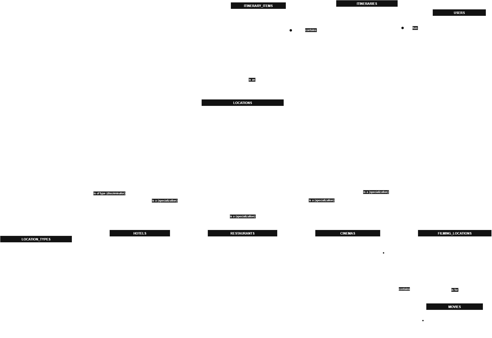

### UserStories
1.      As a logged-in user, I want to create a new, named itinerary for a specific set of dates so that I can start organizing my trip.
2.      As a logged-in user, I want to add an ITINERARY_ITEMS (like a museum or restaurant) to a specific day in my itinerary so that I can build my daily schedule.
3. 	    As a logged-in user, I want to view my itinerary organized by day so that I can see my plan at a glance.
4. 	    As a user, I want to see major attractions, restaurants, and hotels as pins on an interactive map of Egypt so that I can understand their geographical context.
5. 	    As a user, I want to search for a movie title so that I can see a list of its filming locations & Cinemas showing it in Egypt.
6. 	    As a user, I want to click a "Book Now" button on a location's detail page so that I am official reservation page or a partner service to book  (e.g., Booking.com, Expedia) to securely complete my reservation.

### EERD

